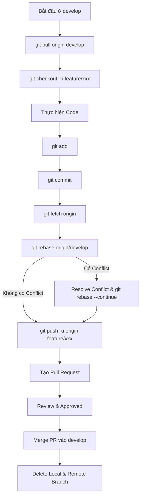

# Quy chuẩn Quản lý Nhánh và Đồng bộ Git (Git Workflow & Rebase Rules)

## Tổng quan
Quy chuẩn này thiết lập luồng làm việc nhất quán với Git trong dự án. Mục tiêu là duy trì lịch sử commit sạch, tuyến tính (Linear History), tránh các merge commit không cần thiết và đảm bảo an toàn khi cộng tác nhóm.

## Quy tắc cốt lõi
1. **Lịch sử commit sạch (Linear History)**: Ưu tiên sử dụng `git rebase` thay vì `git merge` thông thường để tích hợp các thay đổi mới nhất từ nhánh chính vào nhánh tính năng của bạn. Điều này tránh tạo ra các merge commit rác ("Merge branch 'develop' into ...").
2. **Không commit trực tiếp lên main/develop**: Mọi thay đổi phải được thực hiện trên nhánh tính năng (Feature Branch) và đưa vào các nhánh chính thông qua Pull Request (PR).
3. **Luôn làm việc trên Feature Branch**: Tạo nhánh mới từ nhánh cơ sở (ví dụ `develop`) với tiền tố rõ ràng (ví dụ: `feature/xxx`, `bugfix/xxx`, `hotfix/xxx`).
4. **Luôn đồng bộ với nhánh gốc**: Trước khi thực hiện Push hoặc tạo Pull Request, bắt buộc phải đồng bộ và rebase nhánh tính năng của bạn với nhánh gốc (`develop`) mới nhất.
5. **Cảnh báo về Rebase**: Không bao giờ thực hiện rebase trên các nhánh công khai đã được chia sẻ rộng rãi hoặc đã được merge vào nhánh chính (như `develop` hay `main`) nếu điều đó ảnh hưởng đến người khác, vì rebase sẽ viết lại lịch sử commit (rewrite commit history). Chỉ nên rebase trên nhánh tính năng cá nhân của bạn.

---

## Quy trình chuẩn (Git Flow/Rebase Workflow)



### Chi tiết các bước thực hiện

#### Bước 1: Đồng bộ nhánh cơ sở local với remote
Đứng tại nhánh `develop` và kéo các thay đổi mới nhất:
```bash
git checkout develop
git pull origin develop
```

#### Bước 2: Tạo và chuyển sang nhánh tính năng mới
Tên nhánh nên tuân theo định dạng: `feature/<tên_tính_năng>` hoặc `bugfix/<tên_lỗi>`:
```bash
git checkout -b feature/xxx
```

#### Bước 3: Thực hiện code và commit cục bộ
Thực hiện các chỉnh sửa mã nguồn, sau đó add và commit:
```bash
git add <các_file_thay_đổi>
git commit
```

#### Bước 4: Đồng bộ hóa và Rebase với develop mới nhất
Để tránh xung đột khi merge và giữ lịch sử commit tuyến tính, fetch code mới nhất từ remote và rebase:
```bash
git fetch origin
git rebase origin/develop
```

**Cách xử lý nếu xảy ra Xung đột (Conflict) trong quá trình Rebase:**
1. Git sẽ tạm dừng rebase và chỉ ra các file bị conflict. Mở các file đó ra và giải quyết xung đột (chọn mã nguồn đúng).
2. Sau khi đã giải quyết xong, chạy lệnh đánh dấu đã resolve:
   ```bash
   git add <tên_file_đã_sửa>
   ```
3. Tiếp tục quá trình rebase bằng lệnh:
   ```bash
   git rebase --continue
   ```
   *(Lưu ý: Tuyệt đối không dùng `git commit` trong quá trình rebase. Nếu muốn hủy bỏ hoàn toàn rebase đang thực hiện nửa chừng, hãy chạy `git rebase --abort`).*

#### Bước 5: Push nhánh tính năng lên Remote
Sau khi rebase thành công và chạy thử ứng dụng không lỗi, push nhánh lên server:
```bash
git push -u origin feature/xxx
```
*(Nếu bạn đã từng push nhánh này lên remote trước đó và sau đó thực hiện rebase lại local, lịch sử commit đã bị thay đổi, bạn sẽ cần push force một cách an toàn: `git push --force-with-lease`).*

#### Bước 6: Tạo Pull Request (PR) & Code Review
- Lên nền tảng Git (GitHub/GitLab) tạo Pull Request từ `feature/xxx` vào `develop`.
- Chờ đồng đội review và Approve.

#### Bước 7: Merge & Xóa nhánh
- Sau khi PR được merge vào nhánh chính:
- Xóa nhánh remote thông qua giao diện web hoặc chạy lệnh:
  ```bash
  git push origin --delete feature/xxx
  ```
- Chuyển về nhánh `develop` ở local, pull code mới nhất và xóa nhánh local cũ:
  ```bash
  git checkout develop
  git pull origin develop
  git branch -d feature/xxx
  ```

---

## Hướng dẫn thực hiện cho Agent (Git Workflow Checklist)
1. **Kiểm tra trạng thái Git**: Trước khi đề xuất bất kỳ thay đổi nào hoặc thực hiện các thao tác git cho người dùng, hãy xác minh nhánh hiện tại bằng `git status` và `git branch`.
2. **Không commit trực tiếp lên main/develop**: Luôn nhắc nhở hoặc thực hiện checkout sang nhánh feature mới nếu phát hiện đang ở main/develop.
3. **Ưu tiên Rebase**: Khi đồng bộ code, luôn đề xuất các lệnh `fetch` và `rebase` thay vì `pull` trực tiếp tạo merge commit trên nhánh tính năng.
4. **Hướng dẫn người dùng giải quyết xung đột**: Nếu chạy lệnh rebase gặp conflict, hãy phân tích kỹ các file xung đột và đưa ra giải pháp giải quyết trực quan, an toàn cho người dùng.
