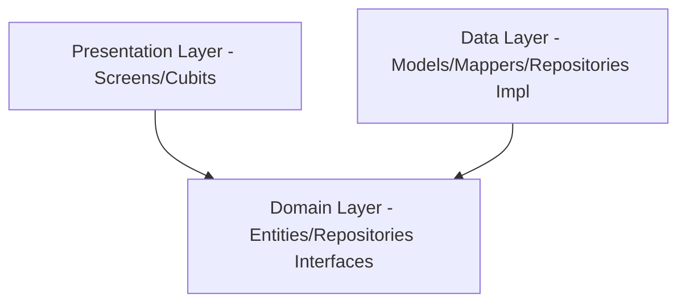

# 📸 SnapSpot — Location-Based Photo Social Network

[](https://flutter.dev)
[](https://dart.dev)
[](#-kiến-trúc--luồng-dữ-liệu)
[](LICENSE)

> **Slogan:** Capture the World.
>
> **SnapSpot** là mạng xã hội chia sẻ ảnh dựa trên vị trí địa lý độc đáo. Ứng dụng cho phép người dùng lưu lại những khoảnh khắc đẹp gắn với toạ độ thực tế trên bản đồ thế giới, giúp bạn bè và cộng đồng dễ dàng khám phá các địa điểm check-in hấp dẫn xung quanh họ.

---

## 🌟 Chức năng chính (Key Features)

### 📌 Đã triển khai (Version 1 & 2)
1. **Xác thực người dùng (Authentication):** Đăng ký, đăng nhập và bảo mật thông tin phiên với Local Cache.
2. **Bảng tin (Feed Explore):**
   - **Tất cả bài viết:** Dòng thời gian hiển thị hình ảnh từ mọi người dùng.
   - **Bài viết gần đây (Nearby Feed):** Sử dụng toạ độ GPS để tính khoảng cách và hiển thị bài đăng xung quanh vị trí người dùng.
   - **Tương tác xã hội:** Thích (Like) và Bình luận (Comment) bài đăng.
3. **Khám phá bản đồ (Map Explore):** Định vị vị trí thực của thiết bị, đánh dấu trực quan (Markers) các vị trí bài đăng trên bản đồ trực tuyến.
4. **Trình biên tập & Đăng ảnh (Camera & Post Editor):** Chụp ảnh mới, nhập mô tả, gắn thẻ Hashtags và đính kèm vị trí địa lý trước khi chia sẻ.
5. **Trò chuyện trực tiếp (Realtime Chat Simulation):** Gửi nhận tin nhắn, cập nhật dòng tin gần nhất và quản lý số tin nhắn chưa đọc.
6. **Trang cá nhân (User Profile):** Hiển thị danh sách ảnh đã đăng, số lượng người theo dõi (Followers), và hỗ trợ cài đặt cấu hình.
7. **Đa ngôn ngữ & Giao diện (Localization & Theming):**
   - Hỗ trợ đầy đủ Tiếng Việt và Tiếng Anh.
   - Giao diện Material 3 bắt mắt, hỗ trợ chuyển đổi mượt mà chế độ Sáng / Tối (Light/Dark Mode).

---

## 🧭 Các Tab điều hướng chính (Navigation Tabs)
Ứng dụng sử dụng cấu trúc **Persistent Bottom Navigation** gồm 5 màn hình chính:
1. **🏠 Bảng tin (Home Feed):** Nơi xem bài viết và chuyển đổi giữa Tab *Tất cả* & *Gần đây*.
2. **🗺️ Khám phá (Map Explore):** Xem bản đồ phân bố các bài viết quanh vị trí hiện tại.
3. **📸 Máy ảnh (Camera):** Chụp ảnh nhanh và chia sẻ ngay lập tức.
4. **💬 Trò chuyện (Chat Rooms):** Danh sách các hội thoại với bạn bè.
5. **👤 Cá nhân (Profile):** Kho lưu trữ các khoảnh khắc và quản lý cài đặt cá nhân.

---

## 🏗️ Kiến trúc & Luồng dữ liệu (Clean Architecture)

Dự án áp dụng chặt chẽ mô hình **Clean Architecture** chia làm 3 lớp riêng biệt:



- **Domain Layer:** Chứa các thực thể cốt lõi (`Entities`) và giao diện định nghĩa kho dữ liệu (`Repositories`). Lớp này độc lập hoàn toàn và không phụ thuộc bất cứ thư viện ngoài nào.
- **Data Layer:** Chứa các lớp ánh xạ dữ liệu (`Models` với Freezed & json_serializable), tệp chuyển đổi dữ liệu (`Mappers` tách biệt theo nguyên tắc đơn nhiệm SRP), và triển khai nghiệp vụ lấy dữ liệu (`Repositories Impl`).
- **Presentation Layer:** Các widget giao diện (`Screens`/`Widgets`) và lớp quản lý trạng thái (`BLoC/Cubit`).

### 📦 Các Công nghệ & Thư viện sử dụng
- **State Management:** `flutter_bloc` (Cubit).
- **Service Locator / DI:** `get_it` giúp tách biệt hoàn toàn khởi tạo phụ thuộc qua Constructor Injection.
- **Functional Programming:** `fpdart` để xử lý các lỗi hoặc luồng kết quả dạng toán tử `Either<Failure, Success>`, đảm bảo code không bị văng crash ngoài ý muốn.
- **JSON Serialization:** `freezed` & `json_serializable` tự động tạo mã nguồn Model bất biến.
- **Local Database:** `hive` lưu trữ phiên đăng nhập và các cấu hình cục bộ của người dùng.

---

## 📂 Sơ đồ cấu trúc thư mục Code (lib/)
```text
lib/
├── core/                       # Các tài nguyên dùng chung cho toàn dự án
│   ├── constants/              # Màu sắc, font chữ, độ đệm lề chung
│   ├── di/                     # Cấu hình Service Locator (get_it)
│   ├── error/                  # Định nghĩa các lỗi nghiệp vụ (Failures)
│   ├── localization/           # Đa ngôn ngữ Việt / Anh
│   ├── network/                # Định vị, mock data, cấu hình Router
│   ├── theme/                  # Hệ thống Theme sáng/tối
│   ├── utils/                  # Tiện ích tính khoảng cách, chuyển đổi toạ độ
│   └── widgets/                # Các widget thiết kế dùng chung toàn ứng dụng
└── features/                   # Chia mã nguồn theo từng Feature (Domain-driven)
    ├── auth/                   # Tính năng Xác thực (Đăng nhập, Đăng ký)
    ├── camera/                 # Tính năng Máy ảnh & Đăng ảnh
    ├── chat/                   # Tính năng Trò chuyện trực tuyến
    ├── feed/                   # Tính năng Bảng tin, Thích, Bình luận
    ├── map/                    # Tính năng Bản đồ và định vị địa lý
    └── profile/                # Tính năng Trang cá nhân và cài đặt
```

---

## 🚀 Hướng dẫn Thiết lập & Chạy dự án

### 🛠️ Yêu cầu hệ thống
- **Flutter SDK:** `>= 3.19.0`
- **Dart SDK:** `>= 3.3.0`

### 📥 Các bước khởi động
1. **Clone mã nguồn về máy cá nhân:**
   ```bash
   git clone https://github.com/sanggit999/snapspot.git
   cd snapspot
   ```

2. **Cài đặt các gói phụ thuộc (Dependencies):**
   ```bash
   flutter pub get
   ```

3. **Chạy trình biên dịch sinh mã tự động (Build Runner) để tạo các file Freezed & JSON Model:**
   ```bash
   dart run build_runner build --delete-conflicting-outputs
   ```

4. **Kiểm tra phân tích mã nguồn tĩnh (Static Analysis) bảo đảm không có lỗi:**
   ```bash
   flutter analyze
   ```

5. **Chạy bộ kiểm thử tự động (Unit/Widget Tests):**
   ```bash
   flutter test
   ```

6. **Chạy ứng dụng trên thiết bị giả lập hoặc thiết bị thật:**
   ```bash
   flutter run
   ```

---

## 📚 Hệ thống Tài liệu chi tiết (Project Documentation)

Toàn bộ các tài liệu hướng dẫn kỹ thuật chi tiết của hệ thống được lưu trữ trong thư mục [docs/](file:///d:/Flutter/snapspot/docs):

*   📌 **Tài liệu tổng quan:**
    *   [00 - Tổng quan dự án](file:///d:/Flutter/snapspot/docs/00-project-overview.md)
    *   [01 - Thuật ngữ & Định nghĩa](file:///d:/Flutter/snapspot/docs/01-glossary.md)
    *   [02 - Quy tắc nghiệp vụ](file:///d:/Flutter/snapspot/docs/02-business-rules.md)
    *   [03 - Yêu cầu chức năng](file:///d:/Flutter/snapspot/docs/03-functional-requirements.md)
    *   [04 - Yêu cầu phi chức năng](file:///d:/Flutter/snapspot/docs/04-non-functional-requirements.md)
*   🏗️ **Kiến trúc ứng dụng:**
    *   [05 - Kiến trúc hệ thống](file:///d:/Flutter/snapspot/docs/architecture/05-system-architecture.md)
    *   [06 - Cấu trúc thư mục chi tiết](file:///d:/Flutter/snapspot/docs/architecture/06-folder-structure.md)
    *   [07 - Hướng dẫn Clean Architecture](file:///d:/Flutter/snapspot/docs/architecture/07-clean-architecture.md)
    *   [08 - Quản lý trạng thái](file:///d:/Flutter/snapspot/docs/architecture/08-state-management.md)
    *   [09 - Sơ đồ và cấu trúc điều hướng](file:///d:/Flutter/snapspot/docs/architecture/09-navigation.md)
*   🎨 **Giao diện & Trải nghiệm:**
    *   [11 - Design System chi tiết](file:///d:/Flutter/snapspot/docs/frontend/11-design-system.md)
    *   [12 - Cấu trúc Theme](file:///d:/Flutter/snapspot/docs/frontend/12-theme.md)
*   ⚙️ **Dịch vụ Backend & Bảo mật:**
    *   [16 - Quy chuẩn thiết kế API](file:///d:/Flutter/snapspot/docs/backend/16-api-standard.md)
    *   [24 - Chính sách bảo mật hệ thống](file:///d:/Flutter/snapspot/docs/security/24-security.md)
*   🧪 **Kiểm thử & Lộ trình:**
    *   [31 - Hướng dẫn viết Tests](file:///d:/Flutter/snapspot/docs/quality/31-testing.md)
    *   [34 - Lộ trình phát triển sản phẩm](file:///d:/Flutter/snapspot/docs/roadmap/34-roadmap.md)
