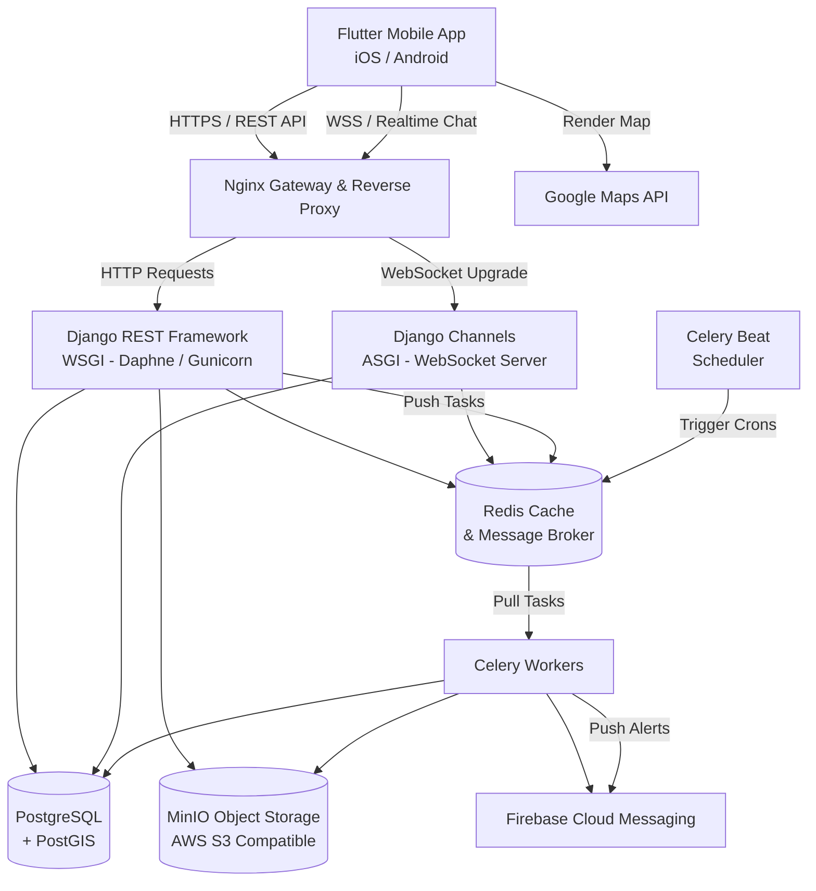

# 05 - System Architecture

Tài liệu này đặc tả chi tiết kiến trúc hệ thống tổng thể (High Level Architecture) của ứng dụng SnapSpot.

---

## 1. Sơ đồ Kiến trúc Tổng thể (Architecture Diagram)

---

## 2. Mô tả vai trò các thành phần (Component Roles)

### 2.1. Lớp Giao diện (Frontend Client)
- **Flutter (Dart)**: Phát triển ứng dụng lai (Hybrid App) chạy trên cả Android và iOS.
- Sử dụng thư viện **flutter_bloc (Cubit)** làm giải pháp quản lý trạng thái và **GoRouter** quản lý chuyển hướng trang.

### 2.2. Lớp Đăng nhập & Điều phối (Gateway & Proxy)
- **Nginx**: Hoạt động như một cổng Gateway bảo vệ hệ thống. Chịu trách nhiệm:
  - Cấu hình SSL/TLS (Chỉ cho phép HTTPS).
  - Điều hướng các API request thông thường sang máy chủ WSGI (Gunicorn/Daphne) và nâng cấp các kết nối trò chuyện sang cổng ASGI (Daphne/Uvicorn).
  - Giới hạn lưu lượng (Rate Limiting) ở tầng mạng để tránh DDoS.

### 2.3. Lớp Xử lý Logic (Backend Services)
- **Django REST Framework (WSGI)**: Chịu trách nhiệm xử lý các luồng nghiệp vụ không đồng bộ ngắn hạn (đăng bài, xác thực, bình luận, tương tác cơ sở dữ liệu).
- **Django Channels (ASGI)**: Xử lý các kết nối WebSocket duy trì lâu dài phục vụ cho tính năng gửi tin nhắn trò chuyện (Chat) thời gian thực.
- **Celery & Celery Beat (Background Tasks)**:
  - **Celery Worker**: Thực hiện các tác vụ nặng chạy nền không chặn luồng xử lý chính của người dùng (nén ảnh, gửi thông báo đẩy qua FCM, thống kê dữ liệu).
  - **Celery Beat**: Lập lịch chạy các tác vụ định kỳ (dọn dẹp ảnh rác, tính toán các điểm check-in thịnh hành hàng giờ).

### 2.4. Lớp Cơ sở Dữ liệu & Lưu trữ (Databases & Storage)
- **PostgreSQL (+ PostGIS)**: Lưu trữ dữ liệu cấu trúc (thông tin người dùng, bài đăng, bình luận, tin nhắn). Phần mở rộng **PostGIS** giúp lưu trữ tọa độ địa lý dạng hình học (`GEOGRAPHY(Point, 4326)`) hỗ trợ truy vấn bán kính khoảng cách hiệu năng cao.
- **Redis**: 
  - Đóng vai trò là bộ đệm (Caching) lưu phiên đăng nhập và kết quả các truy vấn thường xuyên.
  - Hoạt động như một Broker trung gian truyền dữ liệu (Message Broker) cho hàng đợi tác vụ Celery.
  - Làm Channel Layer cho Django Channels điều phối tin nhắn giữa các kết nối WebSocket.
- **MinIO**: Hệ thống lưu trữ đối tượng (Object Storage) tương thích với chuẩn AWS S3. Dùng để lưu trữ tệp tin đa phương tiện (ảnh, video) tải lên từ người dùng.