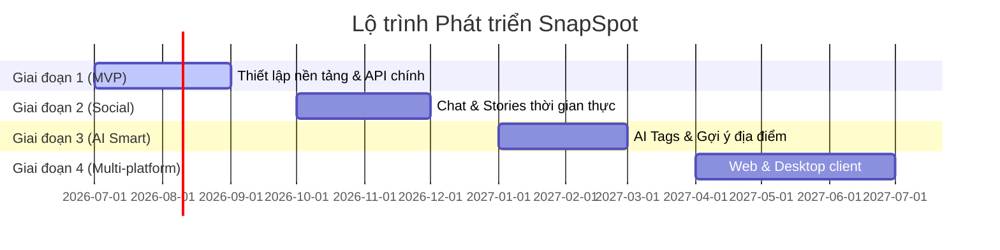

# 34 - Roadmap

Tài liệu này chi tiết hóa lộ trình phát triển (Roadmap) của mạng xã hội SnapSpot qua các giai đoạn phát hành.

---

## 1. Bản đồ lộ trình tổng quan (Roadmap Overview)

---

## 2. Chi tiết các giai đoạn phát triển

### Giai đoạn 1: MVP - Cốt lõi Vị trí & Chia sẻ (Tháng 07/2026 - Tháng 09/2026)
*Mục tiêu*: Hoàn thành bộ tính năng cơ bản nhất để người dùng có thể chụp và đăng tải ảnh check-in lên bản đồ.
- **Frontend (Flutter Mobile)**:
  - Hệ thống đăng nhập/đăng ký, cập nhật Profile cá nhân.
  - Tích hợp camera chụp ảnh, trích xuất GPS EXIF.
  - Bản đồ Google Maps hiển thị các Pin địa điểm bài đăng.
  - Màn hình Bảng tin (Home Feed & Nearby Feed) hỗ trợ cuộn vô hạn.
  - Tương tác cơ bản: Thả tim (Like) và Viết bình luận (Comment).
- **Backend (Django REST)**:
  - Hệ thống API xác thực JWT + Refresh Token Rotation.
  - Xử lý nghiệp vụ Post, Comment, Like.
  - PostGIS tích hợp tính khoảng cách và lọc bán kính lân cận.
  - Hệ thống Presigned URL tải ảnh trực tiếp lên MinIO.
  - Celery chạy nền tối ưu hóa dung lượng ảnh sang WebP.

### Giai đoạn 2: Social - Mở rộng Kết nối (Tháng 10/2026 - Tháng 12/2026)
*Mục tiêu*: Giúp người dùng gắn kết và tương tác trực tiếp với nhau.
- **Trò chuyện trực tiếp (WebSocket Chat)**:
  - Tích hợp Django Channels hỗ trợ phòng chat thời gian thực.
  - Người dùng có thể nhắn tin chữ và gửi ảnh trực tiếp cho nhau.
- **Tin ngắn 24h (Stories)**:
  - Tính năng đăng tải hình ảnh/video ngắn tự động ẩn sau 24h.
  - Thiết kế UI hiển thị bong bóng story tròn ở đầu Feed.
- **Firebase Push Notification**:
  - Gửi thông báo đẩy tức thời khi có tin nhắn mới, có người theo dõi mới hoặc bài viết được bình luận.

### Giai đoạn 3: AI Smart - Khám phá Thông minh (Tháng 01/2027 - Tháng 03/2027)
*Mục tiêu*: Ứng dụng trí tuệ nhân tạo để phân loại ảnh và cá nhân hóa trải nghiệm.
- **AI Tự động gắn tag (Auto Tagging)**:
  - Tích hợp mô hình AI nhận diện vật thể/phong cảnh trong ảnh chụp khi upload (ví dụ: tự động gắn nhãn `#cafe`, `#beach`, `#mountain`).
- **Gợi ý thông minh (AI Recommendation)**:
  - Thuật toán đề xuất bài đăng và địa điểm đẹp dựa trên sở thích lịch sử tương tác và vị trí địa lý của người dùng.

### Giai đoạn 4: Multi-platform & Premium (Tháng 04/2027 - Tháng 07/2027)
*Mục tiêu*: Phủ sóng đa nền tảng và khai thác doanh thu thương mại.
- **Đa nền tảng (Web & Desktop)**:
  - Tối ưu hóa mã nguồn Flutter chạy trên trình duyệt Web và hệ điều hành máy tính (macOS/Windows).
- **Thương mại hóa (Affiliate & Ads)**:
  - Cho phép các đối tác kinh doanh (nhà hàng, quán cafe) tạo "Sponsored Spots" hiển thị nổi bật trên bản đồ.
  - Liên kết dịch vụ đặt xe công nghệ đưa người dùng trực tiếp đến Spot check-in.